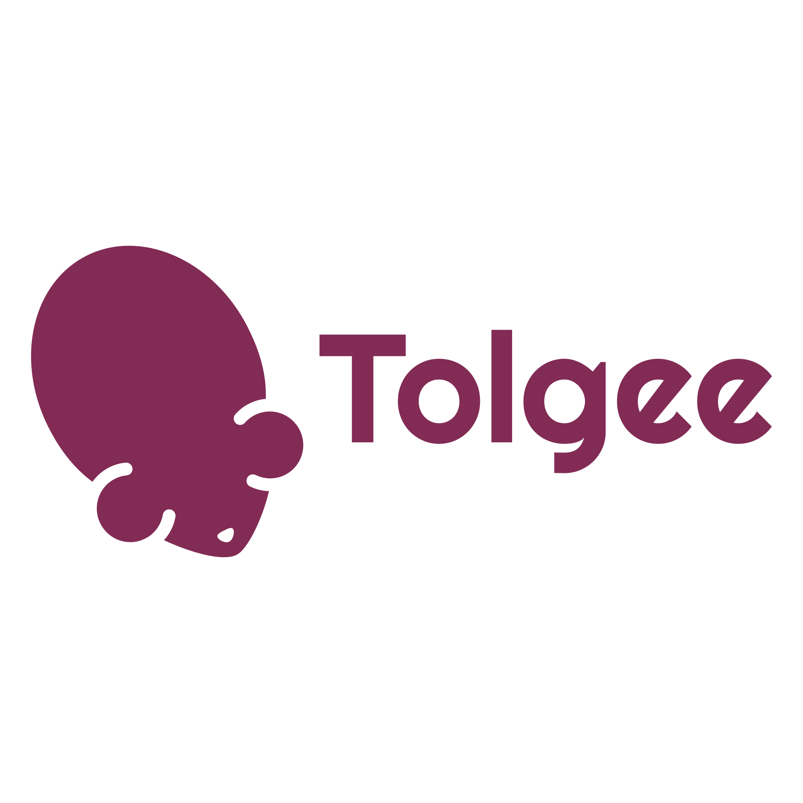

# Tolgee documentation



## Installation

```console
npm install-clean
```

## Local Development

```console
npm run start
```

This command starts a local development server and open up a browser window. Most changes are reflected live without having to restart the server.

## Build

```console
npm run build
```

This command generates static content into the `build` directory and can be served using any static contents hosting service.
