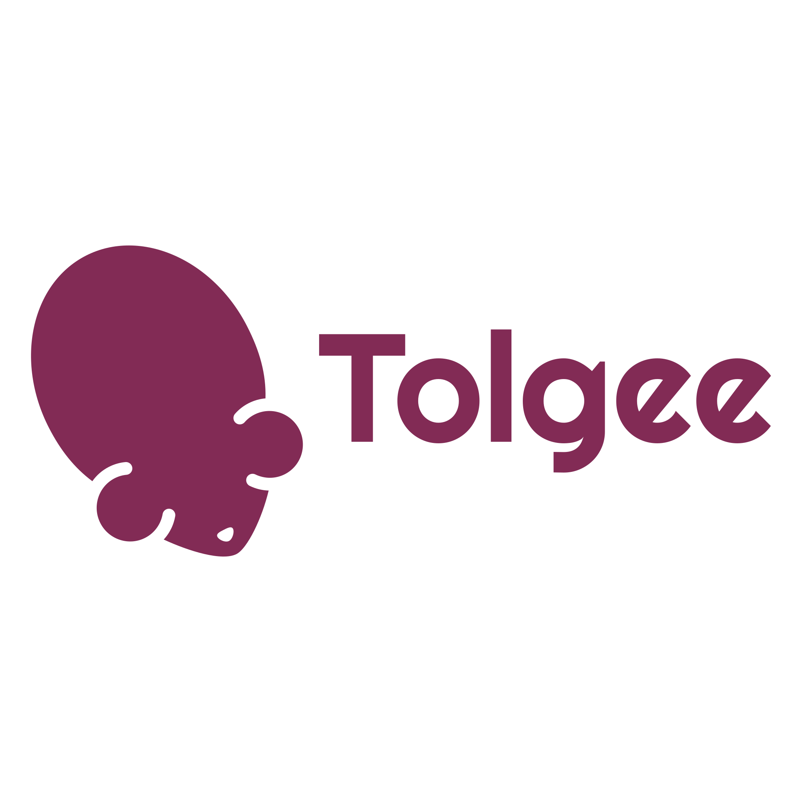

# Tolgee Documentation



> Official documentation for [Tolgee](https://tolgee.io) - the open-source localization platform developers enjoy working with.

Built with [Docusaurus 3.9](https://docusaurus.io/).

## 🚀 Quick Start

### Prerequisites

- Node.js >= 20.0
- npm >= 10.9

### Installation

```bash
npm install-clean
```

### Local Development

```bash
npm run start
```

Starts a local development server at `http://localhost:3001` with hot reload.

### Build

```bash
npm run build
```

Generates static content into the `build` directory.

### Serve Production Build

```bash
npm run serve
```

Serves the production build locally for testing.

## 📝 Content Management

### Generate API Documentation

```bash
npm run generate-api-docs
```

Downloads the latest API spec and generates API documentation pages.

### Generate OG Images

Generate Open Graph images for social media sharing:

```bash
# Generate SVG templates only
npm run generate-og-images

# Convert SVG to PNG (requires ImageMagick)
npm run convert-og-images

# Generate and convert in one command
npm run og-images
```

**Note:** PNG conversion requires ImageMagick: `brew install imagemagick`

Generated images are saved to `/static/img/og-images/`. See [`scripts/README_OG_IMAGES.md`](scripts/README_OG_IMAGES.md) for detailed documentation.

### Other Data Generation

```bash
npm run generate-pricing      # Generate pricing data
npm run generate-platform-config  # Generate platform configuration props
npm run oss                    # Download OSS data
npm run cli-schema             # Download CLI schema
```

## 🧪 Code Quality

### Linting

```bash
npm run eslint              # Run ESLint
npm run prettier            # Format code with Prettier
npm run prettier-check      # Check formatting
npm run tsc                 # TypeScript type checking
```

### Pre-commit

Run all checks before committing:

```bash
npm run prettier && npm run eslint && npm run tsc
```

## 📁 Project Structure

```
documentation/
├── docs/                   # Documentation content (MDX files)
├── src/
│   ├── component/         # React components
│   ├── pages/             # Custom pages
│   ├── theme/             # Docusaurus theme customizations
│   └── css/               # Global styles
├── static/
│   ├── img/               # Images and assets
│   │   └── og-images/     # Open Graph images
│   └── scripts/           # Static scripts
├── scripts/               # Build and generation scripts
├── apiSpecGeneration/     # API documentation generation
├── docusaurus.config.ts   # Docusaurus configuration
├── sidebars.js            # Sidebar configuration
└── package.json           # Dependencies and scripts
```

## 🔧 Configuration

- **Docusaurus Config:** [`docusaurus.config.ts`](docusaurus.config.ts)
- **Sidebar:** [`sidebars.js`](sidebars.js)
- **Theme Customization:** [`src/theme/`](src/theme/)
- **Environment Variables:** Create `.env` file (see `.env.example` if available)

## 📚 Documentation

- [OG Images Guide](docs/OG_IMAGES_GUIDE.md) - Complete guide for Open Graph images
- [OG Images Scripts](scripts/README_OG_IMAGES.md) - Script documentation
- [OG Images TODO](OG_IMAGES_TODO.md) - Implementation checklist

## 🤝 Contributing

1. Fork the repository
2. Create a feature branch: `git checkout -b feature/my-feature`
3. Make your changes
4. Run quality checks: `npm run prettier && npm run eslint && npm run tsc`
5. Build and test: `npm run build && npm run serve`
6. Commit your changes: `git commit -m 'Add some feature'`
7. Push to the branch: `git push origin feature/my-feature`
8. Open a Pull Request

## 🔗 Links

- **Live Documentation:** https://docs.tolgee.io
- **Tolgee Platform:** https://app.tolgee.io
- **Main Repository:** https://github.com/tolgee/tolgee-platform
- **Community Discord:** https://discord.gg/tolgee

## 📄 License

See the main [Tolgee repository](https://github.com/tolgee/tolgee-platform) for license information.
