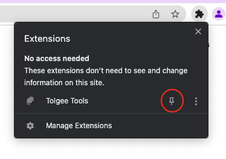
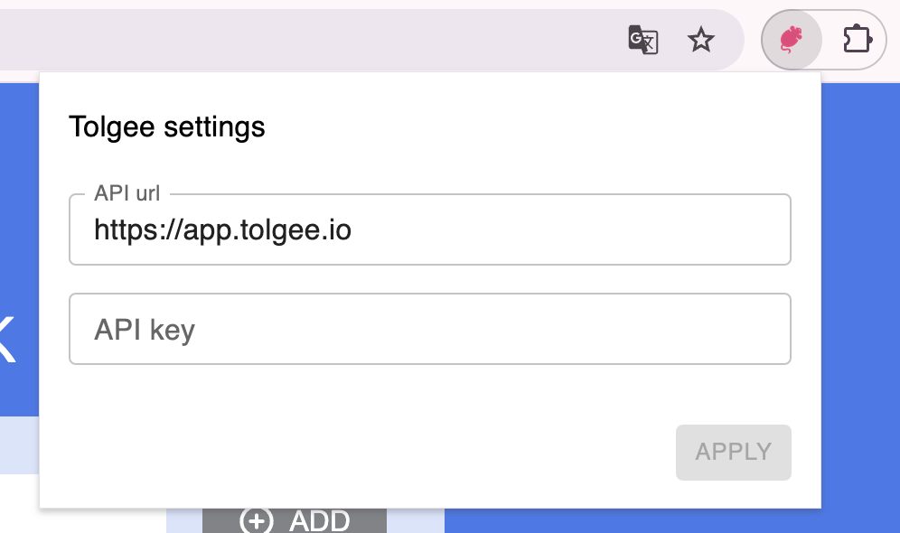
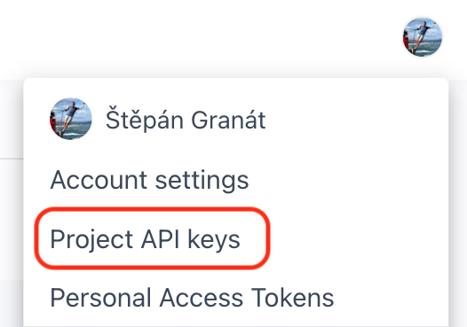
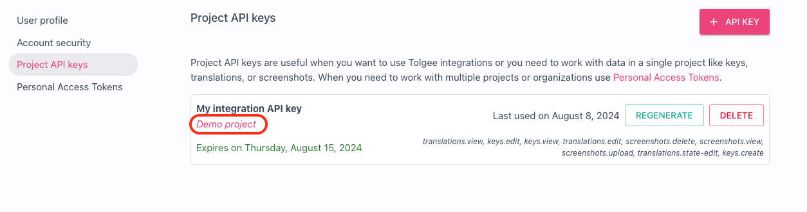
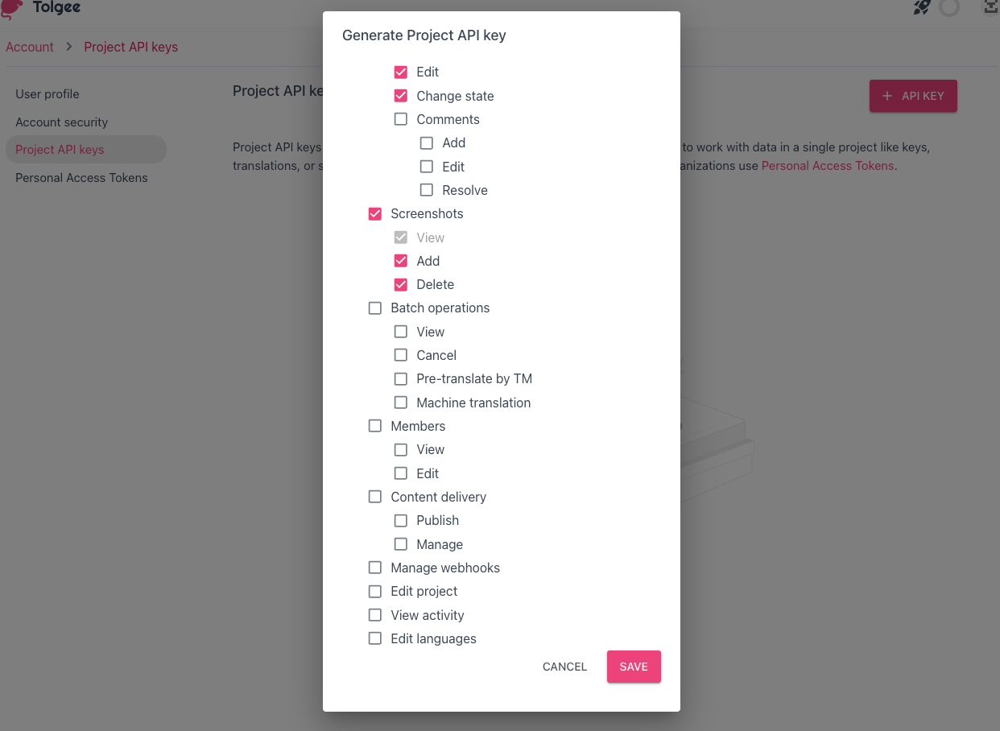
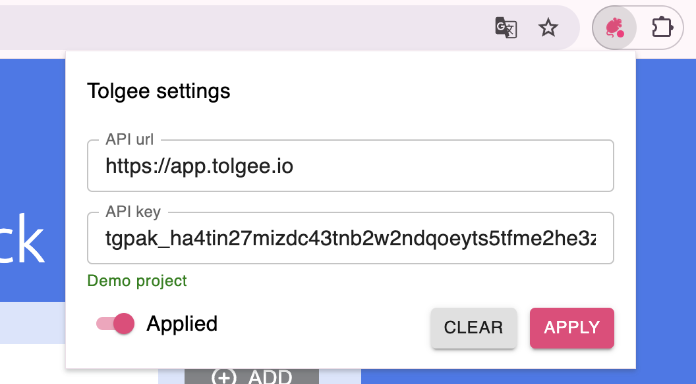
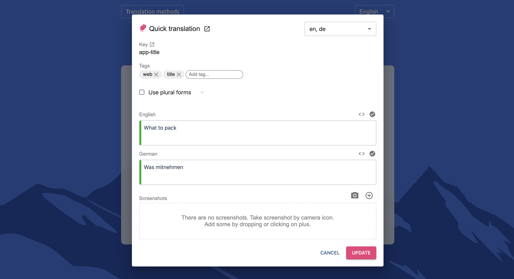

Tolgee [in-context](https://tolgee.io/features/dev-tools) feature is now available on any production page which is using our integration library!
In-context translating brings following advantages:

- Translations editing directly on your page
- Creating and uploading screenshots with one click
- Assurance that new translations fit into your layout before release

In this article, I will show you how it works and how to set it up.

<!--truncate-->

## What do you need

1.  Your web page which is using Tolgee (at least version 3.3.0)
2.  Chrome browser
3.  Access to [Tolgee platform](https://app.tolgee.io/) (or the API key)

## Get Tolgee Chrome extension

Firstly, install [Tolgee Tools](https://chrome.google.com/webstore/detail/tolgee-tools/hacnbapajkkfohnonhbmegojnddagfnj) Chrome extension. After installation, it should be visible in the extensions list.
It's practical to pin it (with the pin symbol), so it's visible in the header bar.

Now, if you navigate to any website which is using Tolgee, it should change its color, if you click on it you should see following dialog:

#### Possible issues

- If Tolgee stays grey and you can't open the dialog, try refreshing the page
  - If it stays grey after the refresh, it means that the page is not using Tolgee SDK
- If you use old version of Tolgee, upgrade Tolgee SDK to version 3.3.0 or newer
- If the dialog opens but the input fields are disabled, it means that in-context is already turned on by default (this should happen only when you run Tolgee locally)

## Obtain an API key

> If you have an API key already you can skip this part.

1. Log in to Tolgee platform
2. Click Account settings in the user menu (right-top corner)

3. Pick an API key from a list (make sure it's for correct project):

- If the key is not created yet, create a new one by "+" button. Make sure, that correct project is selected, leave all permissions enabled and click `Create`.

4. Copy the API key

## Provide the API key to Tolgee

1. Navigate back to your website
2. Open Tolgee Tools extension
3. Fill the API key
   - If `API url` is empty, fill it with `https://app.tolgee.io` (unless you use self-hosted Tolgee platform)
4. Click `Apply`
5. You should see green message `Valid` if your url and key are correct

6. Try opening Translation dialog by holding `Alt/Option` + clicking on any translation
7. You should see "Quick translation" dialog

## Done!

Now you can use In-context to edit any translation on your website and the changes are sent directly to Tolgee platform.

> Read more in [In-context documentation](/docs/sdk/in-context)
