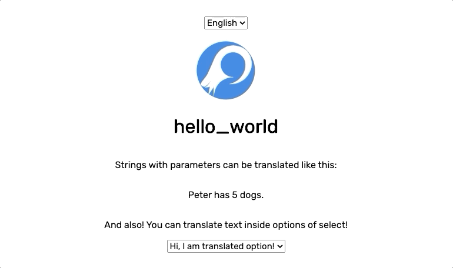

Localization was just so ineffective. Looking for the key in the source code,
looking for the translation in the i18n file. All the localization management was just so ineffective.

Polygloat aims to remove all the complicated operations and let users to simply click and change the translation
directly in the context of running web application, what is localized!

## You'd better use it
Yes, there are other solutions, but...
May you use them for free?
May you run them locally?
May you deploy them on your own server?
Are they open source?

Polygloat is Open Source solution which is universal across all JS frameworks. It has API that you can use to satisfy
all your needs. We look forward to supporting a lot of popular technologies!

## It's not that complex?
Yes, it is not, but it will be. We are in the beginning of long journey that will lead in most complex localization solution ever!