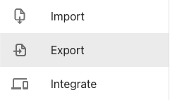

To export translations, go to the app, select project and then choose "Export" item from sidebar.
Afterwards hit "EXPORT ZIP OF .JSON FILES" button. Download will start immediately.



## Exporting via command line

You can also export translations via REST API e.g. via `curl` utility:

```bash
curl https://app.tolgee.io/api/project/export/jsonZip?ak=<YOUR_API_KEY> --output data.zip
```
