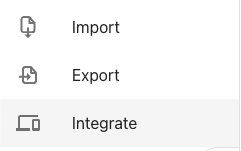
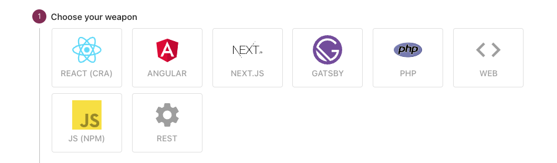

Easiest way to integrate Tolgee with your application is to go to integration guide, directly in project menu.

Follow the steps for your desired library or framework:

This way you can easily integrate new project inluding creating API keys for Tolgee library.

