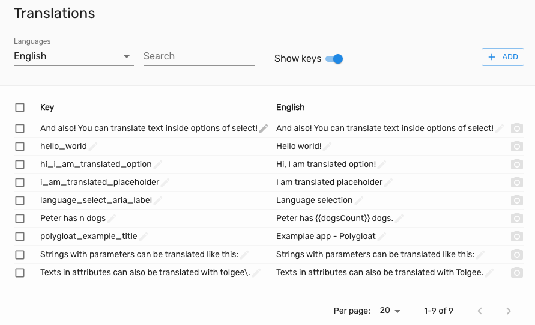

Localization was just so ineffective. The whole management process of creating, managing and fixing localization strings
is sometimes very complicated and involves developers much more than it is actually needed.

We in Tolgee try to reshape the process of software localization with different approach, which aims to save time and
effort of everyone who is getting involved such as developers and translators.

## Easy workflow
With Tolgee, developers are not involved in localization process after the process of development itself. They develop
the app, integrate Tolgee integration libraries and deploy an instance, where translators can change the localization
texts in the context of web application. Texts are then synchronized with Tolgee server (REST API) and there is no need
for developers to be part of the localization process.

1. Develop your app
2. Integrate Tolgee
3. Let translators do their job

## Features
### Simple localization texts management
With Tolgee, you can manage localization texts as simple as editing data in a table.

### Ready for different environments
You can [deploy Tolgee on your local machine](/docs/server_and_web_app/self_hosting/running_with_docker#running-it-locally)
and use it for your local localization management, you can
[deploy it on your cloud infrastructure](/docs/server_and_web_app/self_hosting/running_with_docker#running-with-compose) with production
ready database (PostgreSQL), or you can use the server and web app [deployed by us](https://app.tolgee.io).

### In-context localization for web
With Tolgee integrated in you web application running in the browser, you can use our in-context localization feature, so
you can just click & translate the text. This feature can actually save a lot of time for communication between
translators and developers. In most of the cases translators can change the texts directly in the app and see how it
looks like, so any issues such as typos or broken layout can be solved immediately.

## Tolgee architecture
Tolgee Toolkit consists of Server (REST-API), web application and integration libraries.

Server is REST API based backend service. It is where you store and organize your localization strings. Basically, it
provides a business logic layer between web application and integration libraries. Web application is delivered and deployed
with the server, so it's deployment is very easy.

Integration libraries are using data provided by REST API directly, so texts changed in the web application are propagated
into applications you currently develop.

## Are you missing some features?
Tolgee is not 100% complex yet, but we are on it. We would be happy for any type of
contribution such as feedback or pull requests. If you have somethingg on mind, contact us on [info@tolgee.io](mailto:info@tolgee.io).

## We are at the beginning...
Yes, there are other solutions, but...

May you use them for free?
May you run them locally?
May you deploy them on your own server?
Are they open source?

Tolgee is Open Source solution which is universal across all JS frameworks. It has API that you can use for satisfying
all your needs. We are looking forward to supporting a lot of popular technologies.
